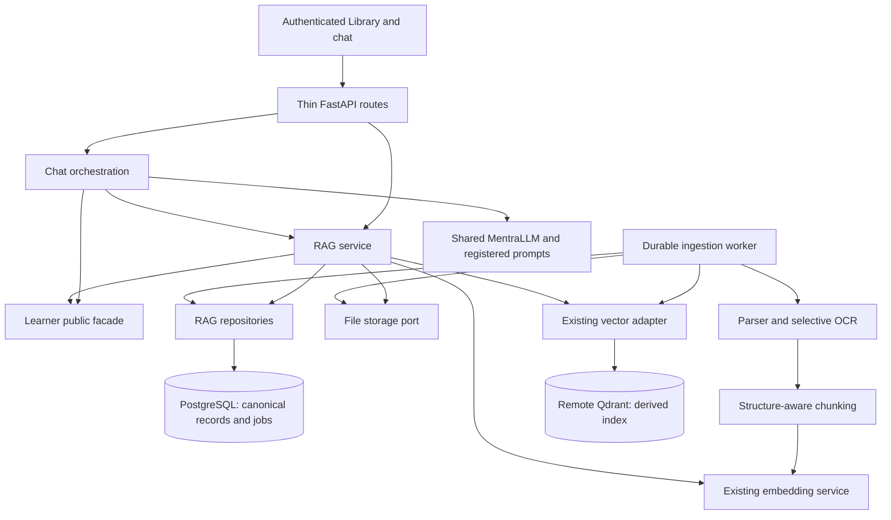

# Mentra RAG System Implementation Plan

**Status:** End-to-end baseline implemented in the working tree; isolated verification recorded in `docs/rag-verification.md`. Application rollout is not performed.
**Reviewed:** 2026-10-08 against the current repository and primary upstream documentation.
**Scope:** End-to-end learner-owned study materials: ingestion, retrieval, provenance, lifecycle, evaluation, authenticated APIs, and fully wired Library/chat frontend workflows.

This revision supersedes the previous phase list. Preserve the existing embedding and vector adapters, but correct their limitations rather than treating the foundations as a complete retrieval implementation. Deliver working vertical slices with explicit acceptance gates. Section 16 maps every original phase to its replacement. A TXT slice is an implementation milestone, not completion of the requested system; the full delivery includes frontend wiring and the evaluated retrieval capabilities in A-E.

## Implementation record (2026-10-08)

The Library upload/detail/version/lifecycle workflows and chat selection/citation/source viewer are wired to authenticated APIs. The durable worker, canonical PostgreSQL generations, private volume, native extraction/selective English OCR, dense/lexical RRF, optional locally baked reranker, canonical tagging, internal assessment contract, identity-bound tools, diagnostics and operator rebuild are implemented. See [runtime contracts](docs/rag.md), [verification and gap decisions](docs/rag-verification.md), and the machine-readable real-model/runtime reports in `docs/`.

Implementation decisions retain the requirements below while distinguishing the initial release from later measured work: exact authoritative generation filters make context reassignment immediately effective without waiting for Qdrant payload refresh; persisted canonical chunks and verified generation points provide recovery caches; the initial chunker uses deterministic structure/token boundaries without overlap; the native adapters replace an unnecessary mandatory Docling stack. Reranking is provisionable and verified but remains opt-in. Production-corpus answer/no-support and handwriting/multilingual quality calibration, optional training/sparse experiments, and zero-downtime dual-model index cutover remain advanced gates, not claims made by the smoke tests. Ordinary same-model reindex/recovery and private-volume persistence are verified. No original phase is dropped from the mapping in section 16.

## 1. Repository findings and changed decisions

| Existing foundation or previous assumption | Implementation decision |
| --- | --- |
| `app/rag/embeddings.py` provides synchronous local BGE inference with baked model identity and normalized vectors. | Reuse it. Add tokenizer budget/capability access and bounded execution; prevent silent truncation. |
| `app/rag/vector_store.py` currently exposes collection validation and close only. | Extend the existing protocol for typed chunk upsert, filtered query, and generation deletion. |
| `app/rag/qdrant_store.py` uses remote URL/API-key configuration, one unnamed dense vector, and a reserved identity point. Compose has no Qdrant service. | Keep remote Qdrant as the deployment baseline. Local Qdrant is an isolated test option. Do not add an operational database service without a need. |
| Qdrant validation rejects named vectors and requires an exact embedding identity. | Dense MVP keeps the existing collection shape. Named/sparse vectors and model changes require explicit collection migration, not an in-place configuration toggle. |
| `app/rag/learner_scope.py` embeds Qdrant filter construction and hardcodes payload `status=ACTIVE`. | Move filter construction into the Qdrant adapter, preserve the scope resolver entry point where practical, and migrate its tests. The current filter cannot express the planned context policies. |
| `LearnerService` owns ACTIVE/RELATED/DORMANT/ARCHIVED contexts and already supports intentional dormant-context selection. | Do not duplicate these states as document lifecycle truth. Context relevance and document archival are separate dimensions. |
| `get_relevant_context()` returns selected IDs and mastery-bearing concepts, but not a complete read-only context authorization snapshot. Explicit IDs can select archived contexts. | Add a minimal read-only context-summary/ownership contract to the Learner facade. Strip mastery from the RAG input; independently enforce retrieval policy. |
| Uploads, document repositories, parsers, OCR, ingestion jobs, search and persistent file storage do not exist. | Implement these as real infrastructure; do not describe framework background tasks as durable jobs. |
| Chat is authenticated, but its route only forwards messages to `ChatService`; Library is a placeholder. | Add identity-bound retrieval and additive citation fields deliberately. There is no existing tutoring graph to extend. |
| PostgreSQL, synchronous SQLAlchemy repositories, Alembic and centralized errors already exist. | Follow these conventions. Database migrations remain explicit; inference, parsing and database I/O must not block async handlers. |
| The original definition of done includes hybrid, reranking and fine-tuning. | Separate a usable production baseline from later measured improvements. Fine-tuning is a research track, not a release dependency. |

## 2. Ownership and runtime architecture

RAG answers which source passages are relevant. Learner owns canonical context/concept identity and learning state. LangChain owns answer generation and prompt composition. RAG never writes evidence/mastery and never imports learner persistence models into its services.



Use a modular monolith plus a worker entry point from the same backend code/image. A worker is a separate process, not an async task inside the API. Each process initializes its own model/client once; explicitly budget the combined RAM and CPU footprint. Begin with one ingestion worker and bounded query inference concurrency. Add an inference service only if measured resource contention warrants it.

Initial infrastructure: existing PostgreSQL, configured Qdrant, and a private persistent filesystem volume shared by API/worker. A file-storage port permits later object storage without changing source contracts. No Redis, separate search cluster, graph database, or mandatory LangGraph dependency is required for the baseline.

Create modules when a delivery uses them. Suggested placement:

```text
backend/app/rag/
  embeddings.py, vector_store.py, qdrant_store.py, learner_scope.py  # extend existing
  schemas.py, ports.py, errors.py, factory.py, dependencies.py
  service.py, ingestion.py, retrieval.py, worker.py, storage.py
  parsers/                 # TXT first, then the chosen document adapter
  processing/              # normalized blocks, deterministic chunking
  repositories/            # tables, PostgreSQL persistence and transactions
  evaluation/              # fixture loader, metrics and runner
backend/app/api/routes/rag.py
backend/tests/rag/
```

## 3. Domain records and consistency boundaries

PostgreSQL is authoritative. Qdrant payloads accelerate candidate selection; they cannot authorize content or establish current document versions.

| Record | Required fields and role |
| --- | --- |
| `rag_document` | ID, internal UUID learner ID, title, original display filename, document archive flag/timestamp, delete-request timestamp, active generation ID, optimistic revision, created/updated/last-used timestamps. Stable user-facing identity. |
| `rag_document_context` | Learner ID, document ID, canonical context ID. Supports one material used in several courses; at least one validated context is required for initial ingestion. |
| `rag_document_version` | Immutable upload identity, document/learner IDs, SHA-256, detected media type, byte size, private storage key, version ordinal, creation time. Explicit replacement creates a version; filename never implies replacement. |
| `rag_generation` | Document/version/learner IDs, pipeline configuration fingerprint, parser/OCR/chunker versions, embedding name/resolved revision/dimension, target index identity, state, chunk count, warnings, timestamps. A derived build, distinct from upload version. |
| `rag_chunk` | Learner/document/generation IDs, deterministic chunk ID/order, canonical text, content hash, heading path, source spans, token count, optional validated concept IDs. Immutable within a generation. |
| `rag_job` | Learner/document/generation IDs as applicable, operation, unique idempotency key, state, attempts, next-attempt time, lease owner/expiry/fencing token, checkpoints, sanitized error code, timestamps. Durable ingestion and cleanup queue. |

Use the repository's shared SQLAlchemy metadata and Alembic imports. Learner IDs use `LearnerId` at boundaries and PostgreSQL UUID foreign keys. Other IDs follow existing text-ID conventions, using generated UUID strings where appropriate. Composite foreign keys enforce learner/document/generation ownership and context association ownership. The active generation must belong to its document. Add uniqueness for generation fingerprint per document version, chunk order per generation, and learner-scoped operation idempotency keys.

Validate canonical concept IDs through Learner public contracts; do not put an unvalidated JSON list behind a promise of referential integrity. Implement normalized chunk-concept links when tagging ships. Learner context foreign keys are permitted in repository schema definitions; RAG services must use the public facade for context policy.

Document lifecycle is available, archived, or delete-requested. Generation state is PENDING, PROCESSING, READY, FAILED or SUPERSEDED. Job state is QUEUED, RUNNING, RETRY_WAIT, SUCCEEDED, FAILED or CANCELLED. A failed replacement does not make the previously published generation unavailable.

Source bytes and parsed artifacts live behind storage references. Never return filesystem paths, Qdrant credentials or unbounded metadata to clients. Define retention for superseded source versions independently from derived-index cleanup; citations to retained versions remain resolvable through authorized source endpoints.

## 4. Durable upload, ingestion and publication

1. Authenticate and bind ownership server-side. Validate context ownership through the Learner facade and reject archived contexts for new material unless an explicit policy permits them.
2. Stream bytes into private staging storage while enforcing limits and hashing. Validate detected type and parser compatibility; filename/MIME supplied by the client are hints. Generated storage keys never use user paths.
3. Finalize the immutable blob atomically on the chosen storage backend. In one PostgreSQL transaction persist document/version/generation plus queued job. Return HTTP 202 with document, generation and job IDs.
4. A worker claims due jobs with a short repository transaction using `FOR UPDATE SKIP LOCKED`, records a lease/fencing token, and commits before expensive work. Renew leases; allow bounded retry with backoff. Every state transition and publication checks the current fencing token.
5. Parse into normalized blocks, clean conservatively, chunk deterministically, persist chunks/checkpoints, and embed in bounded batches. Resume verified stages only when their input/configuration fingerprints match.
6. Upsert deterministic Qdrant point IDs derived from generation ID and chunk ID, with acknowledged completion. Payload includes `record_type=chunk`, learner/document/generation IDs, context IDs and validated concept IDs. The identity-marker point never has chunk eligibility.
7. Verify expected indexed point IDs/count for that generation and index identity. In a short PostgreSQL transaction compare document revision, expected replacement target, delete/archive state and lease token; then mark the generation READY and change `active_generation_id`. Persist superseded-generation cleanup jobs in the same transaction.
8. Cleanup old derived vectors/artifacts asynchronously with exact learner/document/generation selectors. Preserve retained source versions. Report pending cleanup explicitly.

PostgreSQL and Qdrant do not share a transaction. A database job table serves as a transactional outbox for index side effects. Never hold a database transaction open across OCR, inference, storage uploads or Qdrant calls.

Late writes from an expired worker cannot be atomically fenced inside Qdrant. They remain harmless to retrieval because only the authoritative active generation is eligible; a periodic reconciler removes orphan generations/points and repeats tombstone cleanup. Schedule sweeps after the maximum worker execution window, not just immediately after cancellation.

### Idempotency and deduplication

- Same learner, idempotency key and upload parameters returns the same accepted operation. Reusing a key with different content/context/target returns a conflict.
- Hash equality is learner-scoped. Do not disclose whether another learner has the same file.
- Same bytes with a different context association is an explicit association operation, not silently discarded material. An exact duplicate result explains what already exists and whether it is ready, failed or still processing.
- Different bytes under the same name creates a new document unless the caller explicitly targets replacement and supplies an expected revision.
- Staging/finalized files abandoned before metadata commit are reclaimed by a bounded age-based orphan sweep. A worker crash after indexing but before publication resumes the same generation; no duplicate chunks or premature publication.

### Deletion and archival

Archival/deletion first commits an authoritative eligibility change and revision increment. Subsequent retrieval/source reads exclude the document regardless of Qdrant availability. Deletion cancels outstanding jobs and queues idempotent removal of all generations, blobs and parsed artifacts. Retain a minimal tombstone/job record until cleanup and reconciliation succeed; distinguish `delete_requested` from `purged` in API responses.

An already running response uses its final authorization snapshot. Later reads must observe a committed deletion; cancellation of content already sent to a model/client is outside the deletion guarantee. Perform the final eligibility check immediately before handing passages to orchestration.

## 5. Parsing, OCR and chunk budgets

Supported-format scope is staged: TXT first; then digital PDF, DOCX and PPTX; then scanned PDF and PNG/JPEG images. Legacy DOC/PPT is deferred until a pinned conversion path passes security/resource and provenance tests. Upstream support alone is not an application guarantee.

Run a parser spike against representative fixtures before choosing dependencies. Prefer one pinned Docling adapter for structured documents if its extraction, memory, startup and licensing results are acceptable; otherwise select focused native adapters behind the same contract. Implement TXT without a heavy document dependency. Keep optional parsing/OCR dependencies out of the API startup path.

`ParsedDocument` contains ordered `ParsedBlock`s with block type, text, heading path and multiple source spans. Spans can reference physical 1-based PDF page, slide, normalized character offsets, bounding box and extraction method. Record page labels separately when present. Do not invent page numbers for reflowable DOCX/TXT. Chunks crossing pages preserve all spans, not a single misleading page field.

Prefer native text. Route OCR per page/region using measured extraction quality, not simply file extension or total character count. Mixed PDFs need native/OCR deduplication and stable reading order. OCR confidence is nullable and engine-specific; low confidence creates a source warning, never a mastery/evidence mutation. Bake/pin required parser and OCR assets; no runtime model download or external document conversion by default.

Use deterministic heading/block/sentence segmentation before expensive semantic boundary models. Keep slides, code and tables meaningful, splitting oversized units with source-span mappings. Maintain original extraction plus normalization mapping; do not aggressively rewrite formulas or repair words without evidence.

The current BGE small English baseline has a documented 512-token sequence length and 384-dimensional output. Read the actual baked tokenizer/model limit rather than hardcoding this into business logic. Start with a configurable target around 300 embedding tokens and a conservative ceiling around 450 including headings/special tokens, then evaluate. Small overlap may be useful for prose; do not blindly overlap slides/tables. Validate the exact embedding input before encode; oversized inputs are split or rejected instead of silently truncated.

Query limits and answer-context limits are separate: embedding token budget, candidate cap, reranker pair budget, and chat-model context budget must each be enforced. Preserve the existing BGE query instruction once, only for query encoding. Record language; expose the English baseline limitation and evaluate multilingual alternatives against a representative corpus before promising multilingual quality.

Concept tagging is optional after baseline retrieval. Resolve candidates through Learner contracts without automatically registering canonical concepts or altering mastery. Unresolved labels remain noncanonical annotations and never become hard-filter IDs.

## 6. Retrieval contracts and eligibility

The service is framework-independent. Schemas are examples of intended behavior, not new parallel adapters:

```python
RAGService.accept_upload(owner, upload, context_ids, idempotency_key, replacement=None)
RAGService.search(owner, request) -> RetrievalResult
RAGService.get_document(owner, document_id)
RAGService.get_source(owner, source_reference)
RAGService.set_document_contexts(owner, document_id, context_ids, expected_revision)
RAGService.archive_document(owner, document_id, expected_revision)
RAGService.unarchive_document(owner, document_id, expected_revision)
RAGService.reindex_document(owner, document_id, expected_revision, idempotency_key)
RAGService.delete_document(owner, document_id, expected_revision)
```

Owner is a trusted server-bound internal learner identity. HTTP bodies/tools cannot override it. RAG dependencies/factory use application-shared services. Synchronous repositories/embedding/Qdrant calls run through bounded thread boundaries; parsing runs in a killable worker subprocess when needed for hard limits. A thread timeout alone cannot terminate CPU work.

Search request: bounded query, mode (`STANDARD`, `SOURCE_SPECIFIC`, `CROSS_CONTEXT` initially), optional context/document IDs, optional explicit concept filter, result limit, context-token budget, and explicit archived-material consent. Concepts inferred from learner recommendations are ranking hints, not mandatory filters that exclude untagged material.

Context selection rules:

- `None` asks the trusted resolver for relevant contexts. An explicit empty context list means no eligible contexts; return empty results without an unrestricted search.
- `STANDARD` uses Learner-selected ACTIVE/RELATED contexts and may include intentionally query-matched dormant contexts under the existing policy. It does not activate contexts or rewrite their lifecycle.
- `SOURCE_SPECIFIC` validates selected document ownership; it may intentionally access dormant material, but archived context/document access requires explicit consent.
- `CROSS_CONTEXT` validates every requested context and searches only that bounded set. Explicit IDs alone do not bypass archive checks.
- No selected context produces `no_eligible_sources`; the MVP does not search the learner's whole library silently. Upload requires a context, so there is no ambiguous unassigned-source fallback.
- Unknown/unowned IDs fail uniformly without revealing another learner's metadata. Context associations must all be owned; matching any one eligible associated context permits retrieval.

Add `LearnerService.get_context_summaries(learner_id, context_ids)` (or a comparably small read-only public method) for canonical ownership/status checks. Do not use resolution/activation methods merely to validate IDs, and do not reach into Learner tables from retrieval code. Pass only selected context IDs/statuses and concept IDs across the RAG boundary.

Pipeline:

1. Validate owner, request and canonical context policy. Obtain eligible document/generation metadata through RAG repositories.
2. Encode the bounded query; ask the adapter for a bounded candidate set, initially around 40 for 8 final passages, with owner, context and `record_type=chunk` filters. Apply explicit document/concept filters there too. Never query globally then filter by learner.
3. Batch-hydrate canonical chunks through owner-scoped repositories. Reject missing, superseded, archived/deleted or unpublished generations. Do not trust payload text or payload lifecycle flags.
4. Use bounded overfetch/retry if stale candidates consume slots. Return fewer results with a diagnostic if exhausted; never relax ownership/context filters. Schedule reconciliation for persistent stale-index pressure.
5. Optionally fuse/rerank eligible candidates; enforce per-document diversity, remove overlap duplicates, and pack whole passages or traceable excerpts under the answer-context budget.
6. Recheck canonical document/generation eligibility and context archive policy before returning passages. Return stable source references and sanitized diagnostics.

Context reassignment commits new authoritative associations and queues payload refresh. Stale payloads may temporarily reduce recall, but canonical hydration rejects material no longer in scope. Read-after-write source-specific searches can use bounded explicit document/generation selectors while refresh is pending. Do not claim immediate complete recall during an index outage.

`RetrievedChunk` includes canonical chunk/document/version/generation IDs, text, context IDs, concept IDs, source title and source spans. Scores retain type (`dense_similarity`, `rrf`, `reranker`) and component ranks; they are not probabilities. `RetrievalResult` includes chunks, effective mode/scope, token use, pipeline version, warnings and status (`ok`, `no_eligible_sources`, `no_matches`, `degraded`). An unavailable index is a typed dependency failure, not an empty successful search.

Presence of chunks does not prove that an answer is grounded. Remove the ambiguous `grounded` Boolean. Citations can support some claims while an answer still lacks evidence for others.

## 7. Qdrant, hybrid retrieval and index migration

Extend `VectorStore` in place. Keep Qdrant syntax inside `QdrantVectorStore`; domain requests contain typed selectors rather than raw filters. Use the client's `query_points` API after verifying it against pinned `qdrant-client==1.15.1` and the deployed server. Current upstream examples may require newer versions; do not copy them without a capability test.

Create payload indexes for actual filter fields before bulk indexing (owner, context, document, generation and chunk marker); choose types compatible with deployed Qdrant and existing identifier representations. Preserve the identity marker and explicitly exclude it. All deletion selectors include owner and target identity; document deletion must not remove another document or the marker.

Dense retrieval is the baseline. Once evaluation exists, compare PostgreSQL full-text candidates using indexed canonical chunk text against a dedicated sparse/BM25 implementation. PostgreSQL full-text ranking is not BM25. Prefer this small lexical baseline before adding another model or migrating Qdrant. Both branches must enforce the same ownership, context and active-generation policy before fusion. Use deterministic RRF with recorded branch ranks; do not add incomparable raw scores.

If evaluated sparse Qdrant vectors win, build a new collection with explicit dense/sparse schema, encoder/analyzer versions and identity checks. Do not overwrite the existing unnamed-vector collection. Reranking is optional, locally provisioned and bounded to authorized candidates. Benchmark CPU latency/memory; on timeout use eligible pre-reranked results with a warning. Query rewriting/expansion is also optional and must retain the original scope.

Model/schema migration procedure: create and validate a new index, build new generations from retained sources, run quality/consistency checks, pause ingestion publication briefly and catch up changed/deleted documents, then atomically switch the active index routing record plus matching active-generation pointers in PostgreSQL. Bind query encoder identity to that routing snapshot; drain in-flight searches or keep the matching old encoder available. Preserve the old index for a bounded rollback window, replay tombstones to both indexes, and retire it only after rollback expiry. Avoid automatic destructive collection recreation.

## 8. Authenticated API, Library and chat integration

Initial route contracts under `/api/v1`:

| Operation | Contract |
| --- | --- |
| Upload | `POST /documents` multipart; 202 with IDs/state or explicit duplicate result. A reviewed multipart dependency is required. |
| Library | `GET /documents` paginated; `GET /documents/{id}` includes active generation, pending ingestion and warnings. |
| Source | `GET /documents/{id}/versions/{version_id}/source` authorizes ownership and lifecycle; safe download/preview, no raw storage key. |
| Replacement | `POST /documents/{id}/versions` requires expected document revision. |
| Context/archive | `PATCH /documents/{id}` validates associations/revision; conflicts use 409. |
| Unarchive | Same PATCH with `archived=false`; restores document availability without activating its contexts. |
| Reindex | `POST /documents/{id}/reindex` creates a job/generation from retained source; previous READY generation remains usable. |
| Retry | `POST /rag/jobs/{id}/retry` validates retryability and deduplicates concurrent retry submissions. |
| Delete | `DELETE /documents/{id}` returns accepted cleanup state; repeated requests are idempotent. |
| Jobs | `GET /rag/jobs/{id}` owner-scoped progress; bounded explicit retry for failed operations. |
| Search | `POST /rag/search` bounded domain request; owner supplied only by auth dependency. |

Use existing cookie-origin protections, identity dependencies and standardized `AppError` envelopes. Define onboarding requirements consistently with existing workspace routes. Proposed initial limits: 25 MiB upload, 200 pages/slides, 5,000 chunks per document, one concurrent ingestion per learner and one worker globally. Make these centralized settings and tune after fixture measurements. Include decompression/image-pixel caps, parser wall-clock/CPU/RAM limits and owner storage quotas. Reject encrypted/unsupported files clearly; disable parser network access and embedded active content. File MIME/extension validation does not replace resource isolation.

Library uses existing shared UI conventions and API client, with pending/ready/failed states, retry, context association, replacement, archive and deletion feedback. Poll jobs initially; streaming infrastructure is unnecessary for this delivery.

Chat orchestration binds the authenticated learner, resolves context once, calls RAG and passes a bounded source packet through the shared `MentraLLM`. Add a registered RAG context prompt source; do not embed prompts in retrieval services. Source text is untrusted data and cannot authorize tool calls or context expansion.

Extend `ChatResponse` additively with server-generated source references and retrieval status. Give passages stable citation tokens; validate model-returned tokens against the supplied source packet before rendering links. Unknown tokens never create citations. Preserve current content-only consumers. Clearly distinguish retrieval failure from no supporting source; the chat workflow can still offer an ungrounded answer if its UX explicitly communicates that state. RAG does not compose the final prompt or judge every answer claim.

## 9. Evaluation, observability and release gates

Build the evaluation harness with the first retrieval slice. Use retained source/version/span judgments rather than only chunk IDs, because chunk IDs change when chunking changes. Include exact identifiers, paraphrases, tables, code, multi-page citations, OCR errors, multilingual limitations, no-answer questions, unrelated old subjects and explicit cross-context requests. Use separate learners and duplicate filenames/content to test isolation.

Track Recall@k, MRR, nDCG@k, source-span citation accuracy, eligible-context precision, no-answer behavior, candidate rejection rate, ingestion throughput, p50/p95 retrieval latency and peak memory. Set quality/latency targets after a measured dense baseline; correctness gates below are mandatory immediately. Fine-tuning requires licensed/consented data and train/validation/test separation by document/course; keep held-out queries out of synthetic training and hard-negative mining. Compare base, lexical hybrid, reranked and tuned pipelines under the same budgets.

Log trace/job IDs, stage durations, generation/configuration identities and sanitized error codes. Never log source passages, credentials or raw queries by default. Monitor lease expirations, repeated failures, cleanup lag, orphan counts and index identity mismatch. Keep liveness independent of Qdrant/OCR availability; readiness distinguishes configuration, collection compatibility and worker lag without parsing files or downloading models.

Mandatory behavioral verification:

- Two learners cannot retrieve, download, mutate, deduplicate against or inspect each other's resources.
- Empty scope yields zero results; metadata markers and unpublished/superseded generations never appear.
- Dormant recovery is intentional; archived access is explicit; context reassignment cannot leak stale candidates.
- Crash/retry at blob commit, chunk persistence, vector upsert and generation publication preserves idempotency.
- Failed replacement retains the previous working generation; concurrent replacements use revision checks.
- Delete/archive racing a worker prevents publication; Qdrant outage cannot restore deleted eligibility.
- Expired workers cannot publish; their late orphan writes are reconciled.
- Source spans remain accurate through normalization, overlap, multi-page chunking and OCR deduplication.
- Oversized embedding inputs cannot silently truncate; candidate/context and parser resource budgets are enforced.
- Dependency failures use standardized errors; optional reranker failure does not broaden scope.

Use `backend/testing/postgres.py` with explicit dedicated `TEST_DATABASE_URL` and temporary schemas; never test migrations or destructive workflows against the application database. Use Qdrant in-memory fixtures for deterministic adapter tests and an isolated real Qdrant instance for server filtering/index behavior. Rehearse migrations, worker restart and volume persistence before release. Do not treat mock-only tests as proof of cross-store recovery.

## 10. Delivery sequence and concrete first slice

| Delivery | Scope | Exit gate |
| --- | --- | --- |
| A: executable TXT slice | Read-only Learner summary contract; RAG schemas/repository migration; private file storage; durable worker/leases; deterministic TXT parse/chunk; extend existing vector adapter; upload/job/search/source API. | Authenticated TXT upload becomes searchable with source spans; empty scope/isolation/crash retry tests pass against isolated PostgreSQL/Qdrant. |
| B: lifecycle reliability | Replacement generations, archive/context reassignment/delete, revision/fencing checks, cleanup and reconciliation, resource/quota settings. | Race/outage/restart and migration rehearsal gates pass; no stale eligible passages. |
| C: structured documents | Parser spike, pinned PDF/DOCX/PPTX adapter, selective OCR/images, span mapping and tokenizer limits. | Fixture matrix proves advertised format support, extraction quality and bounded worker resources. |
| D: usable product | Library workflows and identity-bound chat grounding/citations; dense evaluation report and operator setup. | Browser workflow passes; citations resolve to authorized retained versions; retrieval failures are visible. |
| E: complete retrieval capabilities | Implement a lexical branch and RRF, configurable reranker and canonical concept-tagging path; compare dense/hybrid/reranked results, evaluate multilingual limitations, complete cache/diagnostic/admin contracts. | Hybrid and reranking can be enabled and evaluated; chosen defaults meet documented quality/latency budgets without correctness regressions. Sparse-index migration is required only if that implementation is selected. |
| F: research | Fine-tuning, semantic chunking, query expansion or graph orchestration only where justified. | Held-out gain and deploy/rollback evidence justify adoption. |

Start with Delivery A: add typed schemas and public context summary lookup, create the reviewed Alembic migration/repositories, extend the existing vector protocol/adapter with typed dense operations, add TXT/storage/job worker behavior, and wire API dependencies. Introduce the settings/Compose storage and worker service needed for that slice. Add evaluation fixtures at the same time. Continue through B-E, including the frontend work in section 12 and the acceptance journey in section 15. Do not stop after the backend or TXT milestone.

The dense baseline covers A-D. The complete end-to-end plan covers A-E: supported formats, durable ingestion, private persisted sources, scoped retrieval, accurate provenance, reliable lifecycle operations, fully wired Library/chat use, enableable hybrid retrieval and reranking, canonical tagging, evaluation and documented recovery. F remains conditional research: the comparison harness is required, but producing/deploying a fine-tuned model depends on adequate licensed data and demonstrated benefit.

## 11. Evidence and decisions to verify during implementation

Repository evidence: `backend/app/rag/*`, `backend/app/main.py`, `backend/app/core/config.py`, `backend/app/learner/services.py`, `backend/app/learner/contexts.py`, `backend/app/learner/schemas.py`, `backend/app/learner/repositories/tables/contexts.py`, `backend/app/auth/dependencies.py`, `backend/app/api/routes/chat.py`, `backend/app/langchain/chat_service.py`, `backend/tests/learner/test_integrations.py`, `backend/requirements.txt`, `backend/standards.md`, and `docker-compose.yml`.

Primary upstream references checked during preparation:

- [BGE model card](https://huggingface.co/BAAI/bge-small-en-v1.5): model limits and query/document instruction behavior; supports the token-budget and English-baseline decisions.
- [Qdrant Query API and hybrid retrieval](https://qdrant.tech/documentation/search/hybrid-queries/): staged retrieval/fusion capabilities; deployed server and pinned client compatibility still require execution tests.
- [Qdrant payload indexing](https://qdrant.tech/documentation/manage-data/indexing/): indexed filter fields; choose deployment-compatible schema before data loading.
- [Docling supported formats](https://github.com/docling-project/docling/blob/main/docs/usage/supported_formats.md) and [pipeline options](https://docling-project.github.io/docling/reference/pipeline_options/): format/OCR adapter spike inputs, not proof that Mentra's uninstalled parser stack works.
- [PostgreSQL 17 SELECT locking](https://www.postgresql.org/docs/17/sql-select.html): queue claim semantics using `SKIP LOCKED`; not a substitute for leases or idempotent side effects.

Remaining measured decisions: parser/OCR versions and asset size, server Qdrant capabilities, worker RAM/CPU limits, source retention periods, storage quotas and corpus-specific quality/latency targets. These are bounded implementation spikes with explicit outputs, not reasons to redesign working foundations or block the TXT slice.

## 12. Frontend implementation and wiring

The frontend is a required deliverable. Extend the current React workspace rather than making a separate RAG application. `LibraryPage.tsx` is presently a placeholder with a disabled upload button; `ChatPage.tsx` drops response metadata when creating an assistant message; `ChatMessage.tsx` renders Markdown only. Each needs actual implementation.

### 12.1 File ownership and shared transport

| Existing/new file | Required change |
| --- | --- |
| `frontend/src/services/api.ts` | Preserve JSON/error behavior and credentialed requests. Add shared binary-response support with the same error parsing, timeout/abort handling and configured API base URL. Multipart FormData must use the browser-generated boundary. Extend `sendChatMessage` to carry an optional typed retrieval selection. |
| `frontend/src/services/rag.ts` | Typed list/detail/upload/replace/context/archive/unarchive/reindex/delete/job/retry/search/source operations. Presentation components do not call fetch directly. |
| `frontend/src/services/learningContexts.ts` | Typed list/create/select context operations backed by authenticated Learner facade routes. Add these routes because the current frontend has no context-management API. |
| `frontend/src/types/rag.ts` | UI-consumed document, job, context, source reference, pagination and retrieval status contracts; preserve null/unknown values. |
| `frontend/src/types/chat.ts` | Add optional immutable per-message sources, validated citation markers, retrieval status and effective scope; keep `ChatTurn` limited to role/content. |
| `frontend/src/pages/LibraryPage.tsx` | Replace placeholder with real paginated material list, filters, upload and lifecycle actions. |
| `frontend/src/components/library/` | Focused upload form, material row/detail, job state, context selector and source viewer components as needed. |
| `frontend/src/pages/ChatPage.tsx` | Own per-conversation retrieval selection; retain response metadata on assistant messages; preserve abort/new-chat behavior. |
| `frontend/src/components/chat/ChatComposer.tsx` | Add accessible source/context selection through focused feature UI. Keep the composer usable without documents. |
| `frontend/src/components/chat/ChatMessage.tsx` | Render validated citation controls and expandable source list alongside existing Markdown. |
| `frontend/src/App.tsx` | Add `/library/:documentId` and version/source detail navigation under existing auth/profile/onboarding guards; preserve `/library` and `/`. |
| `frontend/tests/rag.spec.ts` | Real browser journeys with isolated backend persistence, ingestion worker and Qdrant. |

Reuse `Button`, `Input`, `Select`, `Textarea`, `Spinner`, semantic theme tokens and `lucide-react`. Use local state/feature hooks initially; no global state dependency is necessary. Accessible dialogs/drawers must manage focus, Escape and return focus; create a shared primitive only if a suitable one is absent and reuse it across lifecycle confirmations and source viewing.

The current `apiRequest` reads every response as JSON, so raw source downloads need explicit transport work. Use authenticated Blob requests for downloads/previews and revoke object URLs on close/unmount. Do not derive URLs from storage paths or blindly put a cross-origin cookie-protected URL into an iframe. Show a safe PDF/image preview when supported and extracted text with spans for DOCX/PPTX/TXT; offer original download. Rich third-party previews and full office rendering are not required. Never render uploaded HTML or scripts as trusted content.

### 12.2 Context selection that works for a new learner

Expose `GET /learning-contexts` with pagination/status filters and `POST /learning-contexts` to resolve/create an owned context through Learner contracts. A narrowly scoped PATCH may expose explicit activation/dormancy/archive transitions through the same facade. These are separate from RAG persistence. Their handlers bind the authenticated learner and never expose mastery mutation. Read-only listing must return canonical status without calling activate/resolve as a validation shortcut.

An empty Library offers Add material. Upload asks for an existing context or a context name to create, with an explicit option to make it current. Create-only resolves a RELATED context; activation is a visible user action. Do not infer activation from a document upload. Show current/context status in the selector and permit bounded multi-context association. The user can view dormant/archived material in Library independently of default chat retrieval eligibility.

### 12.3 Library interactions and state handling

1. Fetch the authenticated learner's paginated list. Distinguish first-load spinner, empty library, empty filtered list, retryable error and loaded rows. Preserve pagination/filter state in the URL where useful; do not load the entire corpus into memory.
2. Add material supports a keyboard-operable file input and optional drag/drop. Validate advertised capability/size before submission, choose title/context and submit FormData with one operation idempotency key retained through a network retry. Server validation remains authoritative. Clear successful inputs; retain recoverable input after failure.
3. Treat browser upload and server ingestion separately. Show indeterminate transfer state unless real byte progress is implemented; never label a 202 response READY. After acceptance show queued/parsing/OCR/chunking/embedding/indexing stages from job metadata, warnings and final readiness. Do not invent percentage progress without known totals.
4. Poll only nonterminal jobs with capped backoff; pause when hidden/offline, refresh on return, and abort on unmount/logout. Refresh restores server-owned documents/jobs, not a lost local promise. Merge by document revision/generation to ignore stale poll responses.
5. Show title/type, associated contexts, active version, ingestion stage, warnings and available actions. A failed replacement displays the previous available version plus the failed update. Duplicate upload surfaces the returned existing document and offers explicit context association rather than adding a duplicate row.
6. Detail view shows version history, source preview/download, headings/spans, OCR/coverage warnings, and job failure/retry. Title/context edits and archive/unarchive use expected revisions; on 409 refetch and explain the newer state. Do not automatically resubmit stale mutations.
7. Replacement explicitly targets a document and preserves the active version until publication. Reindex uses retained source, requires no re-upload, and shows its pending generation. Archive hides the material from normal chat; unarchive restores document availability but does not change canonical context state.
8. Delete confirmation names the material and explains source/history removal. After server acceptance remove it from eligible source pickers immediately, show cleanup pending where relevant, and keep retries available. A failed request does not falsely show successful deletion.
9. A ready document offers Study in chat, navigating to `/?document=<id>` (or an equivalent validated selection route). It selects source-specific retrieval; it does not upload the document again or put its text in the URL. Unknown/deleted IDs show a recoverable selection error.

A capability endpoint such as `GET /rag/capabilities` supplies available file formats, effective upload limits and retrieval features. It contains no secrets or unrestricted admin health. This prevents the UI advertising uninstalled OCR or legacy DOC/PPT support. Multiple file upload may submit bounded independent jobs; it is not an all-or-nothing batch promise.

### 12.4 Chat selection and citations

The composer offers automatic relevant material, selected contexts, or selected ready documents. Source choices are fetched from the real Library and show availability/status. Explicit archived-source use requires a visible opt-in. Clear unavailable selections after server refresh and explain why; do not silently broaden a selected-document question to all material. Source-specific dormant access does not activate the context.

Extend the HTTP chat request additively:

```json
{
  "messages": [{"role": "user", "content": "Explain the example on slide 3."}],
  "retrieval": {"mode": "SOURCE_SPECIFIC", "document_ids": ["owned-document-id"]}
}
```

The owner is never sent in this object. The backend validates modes/IDs/consent and bounds retrieval. Omitted `retrieval` enables the trusted automatic policy while remaining compatible with existing clients. No eligible material still permits ordinary chat with an explicit retrieval status. Assessment-grounding policy is unavailable to client-selected ordinary chat modes.

Return the existing `role` and `content`, plus sources, validated citations, retrieval status and effective selection. Choose one canonical citation representation before implementation: stable opaque tokens in answer text, resolved only through server-returned source entries. Render recognized tokens through the Markdown component override or a proper text-node transform; never regex-rewrite fenced code or execute raw HTML. Distinguish sources consulted from claims actually cited. LLM-provided source URLs cannot substitute for authorized source references.

`ChatPage` must store the response sources/status on the matching assistant message. Earlier answers retain their original version references when new material is replaced. Outgoing history remains role/content; the client cannot submit old source packets as trusted new grounding. New chat, logout and identity changes clear selected source IDs, message metadata and private source-viewer state. Abort stale requests so they cannot populate a new conversation or another account.

Citation controls show title and page/slide/section, open the relevant retained version/span and support keyboard navigation. If a source was deleted, archived without consent or purged by retention, show source unavailable; never redirect to a replacement version as though it were the cited passage. If exact visual highlighting is unsupported, show the source excerpt and its honest location instead of a fabricated highlight.

Show concise states for no supporting match, unavailable retrieval and degraded reranking. Fix `getChatErrorMessage` so a RAG 503 is not always called model overload. Keep existing composer text recovery on transport failure. A pending upload cannot be presented as already used to ground an answer; link to ingestion progress and allow a later retry.

### 12.5 Frontend acceptance

Browser checks cover upload from an empty Library, context creation/selection, readiness after refresh, Study in chat, per-answer citations, preview/download, filtering/pagination, retry, replacement, reindex, archive/unarchive and deletion. Include network loss during upload/polling, revision conflict, worker failure, deleted citation, stale async response and switching accounts. Check 320px/375px and desktop layouts, light/dark themes, keyboard/focus behavior, reduced motion and no horizontal overflow. No placeholder upload controls, mock saved documents or unimplemented citation buttons remain in the finished workflow.

## 13. Restored cross-cutting requirements

### 13.1 Caching and invalidation

Begin with ingestion checkpoints as reusable derived artifacts, not a blanket response cache. Define keys and invalidation before enabling each cache:

| Cache | Key and safety rule |
| --- | --- |
| Parsed document | Owned version hash plus parser/OCR configuration, model revision and format. Immutable artifact with retention tied to the source. |
| Chunk embeddings | Embedding identity plus exact normalized input hash and chunker/prefix configuration; owner-scoped storage for private material. Never reuse vectors across model revisions. |
| Query embeddings | Short bounded cache keyed by owner, normalized query and embedding identity; do not persist raw queries by default. |
| Retrieval candidates/results | Optional short-lived cache keyed by owner, query, effective scope/consent, selection revision, active document generations, index and retrieval-policy versions. Every hit is reauthorized/hydrated before use. |

Context transitions/reassignment, replacement, archive/unarchive, delete, index cutover, model/policy changes and logout invalidate affected frontend/server results or change their versioned keys. TTL alone is insufficient for access/lifecycle safety. Avoid full-corpus generation scans just to compute cache keys; use a repository-maintained owner corpus revision if a response cache is introduced. Cached private bytes are cleared on account change and object URLs revoked.

Record `last_used_at` only for actual eligible retrieval/source access, through bounded/batched updates; avoid a synchronous write per chunk. It is usage metadata, not a reason for RAG to activate contexts or mutate learner knowledge.

### 13.2 OCR, chunking and answer evaluation

OCR evaluation includes character error rate (CER), word error rate (WER), reading-order/layout preservation and table extraction quality against transcribed fixtures. Measure downstream retrieval independently. Include digital, scanned and mixed PDFs, skew/low-resolution notes, equations and repeated headers/footers. Normalize whitespace/remove repeated furniture conservatively and test punctuation, code indentation, captions and formula preservation. A fixture with unusable extraction fails ingestion; partial coverage may publish only under an explicit policy with missing-page spans and visible warnings.

Chunking experiments compare fixed token, heading-aware, sentence/semantic and heading-plus-semantic strategies under identical corpus/model/context budgets. Measure precision, recall, citation-span integrity, duplicated context and tokens per useful source. Version every configuration and preserve stable evaluation judgments across different chunk boundaries.

Expand the retrieval evaluation report with Precision@k, context-filter accuracy and reranker lift. Evaluate downstream answer accuracy, groundedness, citation correctness and irrelevant-context rate separately from retrieval scores. Use curated expected answers/support spans and reviewed judgments; an LLM judge is optional and cannot be the only correctness oracle. Include confusing but wrong near-match passages and technical acronym/identifier cases. Improvements must help the actual tutoring workflow, not just one aggregate embedding metric.

Fine-tuning work retains reviewed query/positive passage/hard-negative contracts, license provenance, dataset versions, reproducible seeds and a base-versus-tuned runner. The training tool can be FlagEmbedding or a compatible pinned stack chosen when a justified experiment exists. The runner accepts externally trained checkpoints so comparisons are possible without making production builds download training dependencies.

### 13.3 Additional modes and service capabilities

`CONCEPT_FOCUSED` is a retrieval policy using validated canonical concept IDs; it supports explicit hard filters and separately named soft concept hints. It reuses the same search pipeline. `ASSESSMENT_GROUNDING` is an internal orchestration policy for approved study sources, not access to assessment answer keys or learner evidence. Implement its retrieval contract and tests without inventing a full assessment workflow in the current placeholder screen.

Complete public service capabilities include list/get document, typed search_document wrapper, authorized get_chunk/source, replace, archive/unarchive, context association, reindex/retry and deletion status. `get_chunk` returns bounded canonical text/spans and validates ownership/version/lifecycle. It is not an unrestricted Qdrant point lookup.

Provide operator-only `get_index_health` and resumable `rebuild_index` through a CLI/management service. The current application has no verified administrator role, so do not expose global rebuild over ordinary learner HTTP. Reindex from a learner's Library only targets owned material. Validate index identity, generation coverage and cleanup lag in operator diagnostics without exposing private source content. Rebuild shares generation/job logic and supports dry-run counts, checkpoints and rollback.

### 13.4 Privacy and operational completeness

Correct the original local-data assumption: source bytes, parsing, OCR and embeddings remain local under the baseline, but vectors and filter identifiers go to the configured remote Qdrant service, and selected excerpts go to the configured external chat provider. Minimize Qdrant payloads and keep canonical text in PostgreSQL. Document these data flows; adding external OCR/embedding providers requires an explicit configuration/privacy decision. Never send the whole corpus when bounded passages suffice.

Batch database reads/writes, embeddings, vector upserts/deletions and reindex jobs. Record dense/sparse counts, rejection counts, fusion/reranker ranks and per-stage latency in bounded diagnostic structures. Keep query text/source excerpts opt-in and redacted in production logs. Sanitized failures identify retryable dependency errors versus unsupported/empty/unparseable material, without exposing paths or provider credentials.

Deployment work includes worker service/entry point, shared persistent volume ownership, required multipart/parser/OCR packages, pinned baked assets, migration ordering, graceful shutdown/lease recovery, storage backup/restore and retention cleanup. Confirm upload limits at every actual proxy layer; current frontend Nginx serves static files and browser API calls use `VITE_API_URL`, so changing its limit alone does not fix backend uploads. Confirm browser-resolvable API URLs, cookie origins/CORS and source-download behavior in the target topology.

## 14. Contract and failure-state completion

Document list/detail responses expose document revision, archive/delete state, active version/generation, pending jobs and structured warnings. Jobs expose stage, attempt, retryability, progress counts when known and sanitized failure codes. Cursor pagination has deterministic ordering; search results use bounded source excerpts, never unlimited chunk arrays.

| Condition | API and UI behavior |
| --- | --- |
| Empty/unsupported/encrypted upload | Explicit validation failure and actionable message; no READY generation. |
| Duplicate same operation | Return original IDs/state; refresh the existing row. |
| Idempotency key with different request | 409; user retries as a new explicit operation. |
| Parser/OCR failure or unusable extraction | FAILED with safe stage/error and retry policy; original bytes retained according to policy. |
| Partial extraction allowed by policy | Publish with explicit coverage/OCR warnings; source viewer/chat preserve them. |
| Embedding/indexing failure | No new publication; pending retry/failed job while previous active material remains usable. |
| Wrong embedding/index identity | Typed configuration/dependency failure; no automatic recreation or mixed-model search. |
| No eligible material/no match | Successful typed empty retrieval result, distinguished in chat UI. |
| Qdrant unavailable | Explicit service failure; chat may communicate an ungrounded fallback, never fabricated sources. |
| Sparse/reranker failure | Configured bounded dense/fused fallback with degraded status and trace. |
| Concurrent context/title/archive/replacement edit | 409 with refetch; no silent lost update. |
| Source no longer accessible | Uniform not-found/unavailable behavior; old citation remains visibly unresolved. |
| Delete accepted but purge incomplete | Material ineligible immediately; show pending cleanup, retry internally and reconcile late writes. |
| Session expired/account changed | Abort private requests, clear state, route through existing authentication flow. |

## 15. Full-system acceptance journey and completion gate

Build a dedicated RAG browser test setup: the current `backend/testing/browser_auth_server.py` wires auth/profile only and cannot verify RAG. Use isolated migrated PostgreSQL, temporary source storage, real RAG routes/services and a running worker; isolated real Qdrant covers server behavior. Deterministic embedding/LLM doubles may support fast browser checks, but separate integration runs must use the baked embedding model and real retrieval adapter. No external model download is required for unit tests. Never add testing control routes to the production app.

Required full journey:

1. Register/sign in and finish onboarding; open Library with no material and create/select a learning context.
2. Upload TXT, digital PDF, DOCX, PPTX, scanned/mixed PDF and PNG/JPEG fixture materials through the UI; observe real server jobs and READY states after refresh/restart.
3. Open/download the original and inspect extracted headings/page/slide locations; low-quality OCR/partial extraction displays honest warnings.
4. Study in chat with a selected document; ask a supported question, inspect the answer's citations and open its exact version/span.
5. Switch to Python as current context while old Database material becomes dormant. A decorators query excludes unrelated Database passages; an intentional dictionary/table comparison can retrieve both eligible contexts without deleting historical notes.
6. Use an exact rare identifier and compare dense/hybrid/reranked retrieval on the fixed fixtures. Hybrid and reranker paths can be enabled and measured; defaults follow recorded results.
7. Upload duplicate bytes, then explicitly replace with revised content. During processing/failure the prior version remains usable; after publication the old generation does not answer fresh searches. Earlier citations still resolve to retained versions.
8. Reassign contexts, archive/unarchive and reindex from retained source. Verify source pickers, list/details, chat and authoritative filters agree.
9. Delete while ingestion is running and while Qdrant is unavailable; observe accepted cleanup, immediate retrieval exclusion and eventual physical purge after recovery/reconciliation.
10. Repeat resource access under a second learner/session and verify isolation, no stale client state, and no source/download leaks. Exercise offline recovery, parser failure, job retry and index identity mismatch.

The completed system requires A-E, all frontend interactions above, the original scenario tests A-G, a fixed evaluation report, successful migrations/restart/cleanup checks and operator setup documentation. Run meaningful backend unit/integration suites, frontend `npm run build`, `npm run check:theme`, and Playwright RAG plus existing auth/profile regressions. Record actual results and environment limits. Documentation-only work is not evidence that the system is implemented.

Update `README.md`, RAG module documentation, API/setup docs and the deployment configuration to describe the shipped formats, limits, privacy flows, worker/storage recovery, index migrations and retrieval defaults. No required user journey may depend on Swagger, manually editing IDs, direct Qdrant access or developer-only scripts.

## 16. Original-plan coverage and intentional changes

This inventory was checked against the original tracked plan, including phases 0-39, its invariant list and definition of done. Sections are requirements for implementation, not claims of completed functionality.

| Original phase | Coverage in revised plan | Disposition |
| --- | --- | --- |
| 0 Public contracts/skeleton | 2, 6, 8, 13.3 | Existing foundations extended; no empty duplicate skeletons. |
| 1 Persistence/metadata | 3, 13.1, 14 | Preserved; split upload versions from derived generations and restore usage metadata. |
| 2 Upload/ingestion | 4, 5, 8, 12 | Preserved with durable worker and frontend upload. |
| 3 Validation/deduplication | 4, 8, 12.3, 14 | Preserved with scoped hashing and idempotency conflicts. |
| 4 Parsing | 5, 13.2, 15 | Preserved normalized blocks and structure. Legacy DOC/PPT deferred explicitly; required DOCX/PPTX retained. |
| 5 OCR routing | 5, 13.2, 14 | Preserved native/selective OCR and nullable confidence. |
| 6 Cleaning/normalization | 5, 13.2 | Preserved conservative furniture/artifact cleanup and span mapping. |
| 7 Chunking | 5, 13.2 | Preserved structure/semantic evaluation, material-specific budgets and overlap policy. |
| 8 Concept tagging | 3, 5, 10 E, 13.3 | Required canonical tagging path; automatic tagging may be asynchronous/configurable. |
| 9 Embedding abstraction | 1, 2, 5, 7 | Existing interface retained with tokenizer capabilities. |
| 10 Vector store | 1, 3, 7 | Existing remote deployment retained; local-only assumption corrected. |
| 11 Sparse/BM25 | 7, 10 E, 15 | Required lexical branch; FTS explicitly distinguished from BM25 and sparse migration conditional. |
| 12 Hybrid fusion | 7, 10 E, 15 | Required deterministic RRF and branch diagnostics. |
| 13 Reranking | 7, 10 E, 14 | Required configurable adapter/evaluation; enabling by default is measured. |
| 14 Context-aware retrieval | 6, 12.2, 15 | Preserved with read-only canonical policy and empty-scope safety. |
| 15 Query processing | 5, 6, 7 | Normalization/budgets/resolution required; expansion remains conditional as originally specified. |
| 16 Retrieval modes | 6, 12.4, 13.3 | All five modes accounted for; assessment policy remains internal. |
| 17 Provenance/citations | 3, 5, 6, 12.4 | Preserved and extended to actual frontend source viewing. |
| 18 Retrieval result | 6, 12.4, 14 | Preserved typed results; ambiguous grounded Boolean replaced by status/claim citations. |
| 19 LangChain/LangGraph | 2, 8, 12.4 | Shared MentraLLM wiring required; speculative mandatory graph removed. |
| 20 Learner integration | 1, 2, 6, 12.2 | Public facade only, canonical ownership/status/concepts, no mastery mutation. |
| 21 Lifecycle/reactivation | 3, 4, 6, 8, 12.3 | Context lifecycle separate from document archive; explicit unarchive/reactivation retained. |
| 22 Reindex/versioning | 3, 4, 7, 8, 13.3 | Required resumable reindex, versioned identities and migration/rollback. |
| 23 Updates/replacement | 4, 8, 12.3, 15 | Required explicit replacement with safe generation publication. |
| 24 Deletion | 4, 8, 12.3, 14, 15 | Required eligibility tombstone plus eventual physical cleanup. |
| 25 Fine-tuning | 9, 10 F, 13.2 | Training/comparison contracts retained; training/deployment conditional on licensed data and gain. |
| 26 Evaluation dataset | 9, 13.2, 15 | Required fixed held-out corpus including wrong near matches and context scenarios. |
| 27 Retrieval metrics | 9, 13.2 | Restored Precision@k, reranker lift and downstream answer measures alongside core metrics. |
| 28 Chunking evaluation | 5, 13.2 | Explicit comparative experiments and context efficiency restored. |
| 29 OCR evaluation | 13.2 | Explicit CER/WER/layout/table and downstream measures restored. |
| 30 Caching | 13.1 | Cache keys, authorization and lifecycle invalidation restored. |
| 31 Performance | 2, 4, 6, 9, 13.4 | Batching, concurrency/resource bounds and stage latency retained. |
| 32 Failures | 4, 9, 14 | Explicit parser/OCR/embedding/index/reranker/UI states. |
| 33 Observability | 9, 13.4 | Stage IDs/counts/ranks/latency with private query logging minimized. |
| 34 Security/privacy | 4, 6, 8, 12, 13.4 | Upload isolation, auth, local processing and actual remote data flows documented. |
| 35 Tests | 9, 12.5, 15 | Deterministic adapters plus real persistence/index/browser tests required. |
| 36 Scenarios A-G | 9, 15 | All retained: old material, cross-context, rare term, duplicate, replacement, citation and outage. |
| 37 Agent rules | 1-9, 12-15 | Boundaries, canonical IDs, provenance, budgets, lifecycle, readiness and held-out evaluation preserved. |
| 38 API summary | 6, 8, 12.2, 13.3 | Reindex/unarchive/get_chunk/list/search_document/health/rebuild explicitly accounted for. |
| 39 Implementation order | 10, 15 | Ordered vertical milestones with migrations, contracts, tests and documentation; full implementation continues through A-E. |

All original architectural invariants remain in force with two precision corrections: dormant sources can be selected intentionally without changing their lifecycle, and stale physical vectors may exist during an outage but are never eligible after replacement/deletion publication. Cleanup/reconciliation is still required. Embedding/parser/vector/sparse/reranker replacements remain behind tested ports; citations are never fabricated; only a bounded relevant subset reaches the answer model.
