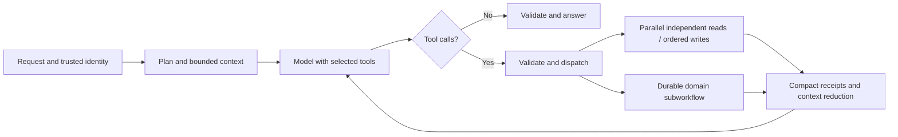

# AI workflow audit and orchestration proposal

Audit date: 10 October 2026. This preserves the findings from the checkout before the workflow fixes, including the pending first-message chat-title changes. It is the original audit and proposal. See [Assessments through chat](chat-assessments.md) for the implemented safeguards, subsequent gap fixes, verification and remaining limits.

## Evidence and limits

210 targeted backend tests passed: 170 assessment, chat-evidence, event, profile, learner, document and vision tests, plus 40 RAG workflow, processing and reranker tests. Database tests used isolated schemas in a dedicated test PostgreSQL instance. Synthetic probes reproduced the tool-result budget mismatch, uncertain-correction evidence problem, grounded-generation fallback and sequential tool dispatch described below. No live model calls, production-data audit, handwriting benchmark or production load test was performed. Token figures are approximate, not provider billing measurements.

## 1. How a chat request uses the domains

Entry point: [orchestration_service.py](../backend/app/langchain/orchestration_service.py), with [planning.py](../backend/app/langchain/planning.py), [chat_service.py](../backend/app/langchain/chat_service.py) and [history_orchestration.py](../backend/app/langchain/history_orchestration.py).

1. A deterministic English-pattern planner chooses modules. Ordinary questions usually select learner, profile and RAG. Personal-memory and agenda requests select their corresponding modules. Attachments select document extraction.
2. RAG is searched before the main model call. Learner context and a small profile packet are also fetched for selected intents. Attachment text is extracted and bounded separately.
3. The main model receives instructions, the selected context, bounded conversation history and tool definitions. Persistent chat offers history/memory, learner and event tools.
4. A custom loop feeds tool results back to the model until it answers or reaches its limits. The server validates source references and returns public citations, proposals and source metadata.
5. A successful qualifying tutoring turn queues background evidence extraction; it does not directly set mastery.

The implementation uses LangChain model adapters and Pydantic schemas. It does not use the separate Pydantic AI agent library.

The planner's per-module token allocations, required flags and most execution-plan metadata are not enforced by chat orchestration. An `assessment` plan step does not execute an assessment workflow. Tool availability is broader than the selected plan. Compound personal/study questions and languages other than English can therefore get an incomplete context selection.

## 2. Learner model, skillset and progress

Sources: [engine.py](../backend/app/learner/engine.py), [retrieval.py](../backend/app/learner/retrieval.py), [evidence.py](../backend/app/learner/evidence.py), [scoring](../backend/app/learner/scoring), [evidence_worker.py](../backend/app/langchain/evidence_worker.py), [learning.py](../backend/app/api/routes/learning.py).

The skillset is concept-level learner state: mastery, confidence, retention, difficulty-related performance and verification needs. Chat receives a relevant packet, normally capped at eight concepts. Retrieval considers owned study contexts, query relevance, related concepts and context activity; archived contexts are excluded by default. Recommendations identify useful practice and uncertain knowledge.

Skill updates are evidence-driven. Assessment grades and qualifying chat demonstrations produce validated observations. Accepted evidence is immutable, deduplicated by source identity and recomputed through deterministic scoring; accepted corrections supersede earlier observations. Reading a document, an AI explanation or completing an agenda event does not itself prove mastery.

Chat evidence is deliberately narrow. It requires an immediately preceding assistant message containing a question mark, skips several request-like prefixes, attachments and oversized answers, then asks a separate model to identify demonstrations. An observation must target an allowed concept, quote the user's actual answer and have confidence at least 0.85. Mastery scoring dampens chat evidence and guided/repeated answers. This helps resist invented learning progress but misses valid demonstrations outside the English heuristics, attachment-based work and answers to questions without `?`.

Retention decays with elapsed time; mastery is a separate signal. Current scoring is heuristic and needs empirical calibration before interpreting its numbers as calibrated probabilities.

The Progress page reads deterministic learner aggregates, recommendations and verification candidates. There is no separate progress agent. Practice links can open chat, but there is no general automatic learning-plan/assessment workflow behind progress.

Performance risks: a bounded output does not bound repository work. Recommendation ranking loads the full relevant concept/state set before selecting its limit. Related-context expansion can add per-item queries, and packet/recommendation/verification requests repeat reads. Evidence recomputation can replay growing histories while holding an owner transaction. Batch reads, request-local reuse and measured policy-compatible snapshots are preferable to reducing evidence integrity.

## 3. Relevant study material and RAG

Sources: [rag/service.py](../backend/app/rag/service.py), [worker.py](../backend/app/rag/worker.py), [processing.py](../backend/app/rag/processing.py), [embeddings.py](../backend/app/rag/embeddings.py).

Library ingestion is a durable workflow: upload, parsing/OCR, bounded chunking, batched embeddings, Qdrant publication, PostgreSQL publication and reconciliation. PostgreSQL owns document and generation truth; Qdrant is derived. Ownership, active generation and eligibility are checked when retrieving and again before returning material.

Chat retrieval combines dense and lexical candidates, fuses rankings, optionally reranks, removes duplicates and limits per-document dominance. Default output is at most eight chunks under an embedding-token budget. User-selected documents or relevant study contexts scope the material. Citations are tied to server-approved source tokens.

Gaps and costs:

- Main chat prefetches RAG once from the original query. Although a RAG tool implementation exists, it is not registered in the persistent chat loop; the model cannot reformulate a search after another tool reveals a better query.
- Document concept tags are manually resolved against existing concepts. Ingestion does not automatically discover canonical concepts or update mastery.
- A valid long chat query can exceed the embedding model's query limit; that specific failure is not handled as the general RAG-unavailable fallback.
- The embedding-query semaphore permits one query at a time per service instance. That can become a queue under concurrent traffic; benchmark before changing it.
- Reauthorization and context selection repeat some learner/database reads. Preserve authorization checks while reusing request-scoped data safely.
- Attachment context has an aggregate character bound, not an exact model-token bound. A prior attachment is reused for follow-ups and can remain present when no longer relevant. PDF/image extraction can dominate initial request latency.

## 4. Assessment generation and grading

Sources: [assessment_workflows.py](../backend/app/langchain/assessment_workflows.py), [assessments/service.py](../backend/app/assessments/service.py), [repository](../backend/app/assessments/repositories/postgres.py), [worker](../backend/app/assessments/worker.py), [schemas](../backend/app/assessments/schemas.py).

Generation validates the owned study context, resolves requested concept names or selects recommendation/verification targets, and optionally retrieves approved source material. The model returns structured questions, private model answers, rubrics, difficulty, concept IDs and source tokens. Validation checks question count and approved IDs/tokens. Public assessment serialization hides private answers and rubrics.

Attempts accept a complete answer map. A durable worker claims submitted attempts, sends the questions/rubrics/model answers and submitted answers to the grading model, validates complete question/concept grading and persists the grade. When confidence passes the threshold, learner evidence and grade completion are applied in one owner transaction. High-confidence corrections supersede previous accepted evidence.

Important gaps:

1. **Uncertain corrections leave stale skill evidence.** Reproduced with isolated PostgreSQL: initial grading accepted two observations; a corrected answer was regraded with confidence 0.5; the attempt became graded with evidence unavailable, while both original observations remained accepted. The corrected submission and skillset can disagree. Define explicit pending/invalidation/supersession semantics without erasing historical evidence.
2. **Confidence is all-or-nothing across an attempt.** One uncertain question suppresses evidence from every otherwise reliable question. Apply confidence decisions per observation and surface partial evidence status.
3. **Independence is assumed.** Assessment evidence sets independence to 1 and hints to 0, without proving the user worked independently. This can inflate mastery when assistance was used. Record unknown/declared/observed assistance separately.
4. **Broad profile evidence is not updated.** Grading updates granular learner skills; it does not feed the student-profile estimate evaluator.
5. **Misconceptions are stored only in grade/evidence metadata.** There is no current producer connecting them to the learner's canonical misconception records, so future learner packets miss that structured signal.
6. **Chat has no assessment generation/grading tools.** Dedicated assessment APIs/UI work, but recognizing an assessment intent in chat does not launch them.
7. **Grounding is not strict in every configuration.** A synthetic `grounded=True` request with no injected RAG service generated without sources. Normal application wiring generally supplies RAG, but the workflow should fail explicitly. Validation also allows a grounded question to have an empty citation list.
8. **Generation can duplicate model cost.** Concurrent identical requests can both generate before persistence deduplicates them. Claim generation work before paying for the model call.

## 5. Paper answers, numbered answers and vision

Sources: [assessments/service.py](../backend/app/assessments/service.py), [vision/service.py](../backend/app/vision/service.py), [vision/providers/local.py](../backend/app/vision/providers/local.py).

Current path:

`upload photo/PDF -> native text or English Tesseract OCR -> numbered-answer splitting -> pending transcription -> user review/confirmation -> complete answer map -> grading model -> learner evidence`

The vision abstraction is present, but its current provider is local Tesseract OCR, not a multimodal language model or a handwriting-specialized recognizer. Scanned PDFs are rasterized; native PDF text is reused when available. Extraction includes size/time/pixel limits and handwriting warnings. OCR confidence is not a reliable populated grading gate here.

Answer splitting recognizes lines such as `1.`, `2)` or `Question 3`, associates their ordinal with the assessment's question UUID and takes text until the next number. Consequently, answers-only sheets can work if OCR and numbering are correct. Subnumbered reasoning, repeated headings, continued answers and mathematical notation can be misassigned. Grading receives confirmed extracted text, not the original image.

This is **automatic extraction with mandatory human confirmation**, not reliable automatic handwritten upload-to-grading. Existing tests do not establish real handwriting or equation accuracy.

Recommended extension: a pluggable handwriting/multimodal extractor receiving the assessment's question-number map, returning typed answer entries with question ID, text, page/region provenance, confidence and ambiguity/missing-answer flags. Validate IDs and coverage server-side. Route ambiguous extraction to review; permit automatic submission only under an explicitly defined confidence/review policy. Preserve the original artifact and transcription revision so corrected readings can supersede grading evidence. Measure a real corpus of numbered handwritten answers, mixed layouts and mathematics before choosing thresholds.

## 6. User profile and concepts

Sources: [student_profile/service.py](../backend/app/student_profile/service.py), [calibration/service.py](../backend/app/student_profile/calibration/service.py), [evidence_service.py](../backend/app/student_profile/evidence_service.py), [policy.py](../backend/app/student_profile/policy.py), [learner/concepts.py](../backend/app/learner/concepts.py).

Profile facts/preferences are user-managed or initialized from the configured education integration. AI does not freely overwrite personal facts. Onboarding calibration deterministically scores answers, records profile evidence and runs a version-fenced model evaluation for overall proficiency, reasoning, quantitative ability, comprehension and domain familiarity. Policy caps changes/confidence. Selected chat intents receive those facts and estimates for personalization.

There is an evidence API for later trusted observations, but current chat and assessment producers do not connect to it. Thus broad profile estimates do not continuously follow concept learning. Conversely, onboarding calibration does not automatically seed granular concept skills. Keep these domains distinct, but add an explicit evidence bridge with reliability limits and aggregation rules.

Concept resolution checks canonical names and aliases first. Unknown labels become review candidates; optional semantic resolution exists but is not wired into the production factory. Assessment generation can register new concepts when the user confirms them. Ordinary chat and document ingestion do not automatically add canonical concepts. Candidate promotion/merge operations exist in the learner facade, but there is no complete exposed review flow in the audited paths. Assessment registration can also bypass candidate resolution, leaving the original candidate pending. Use one idempotent candidate-resolution workflow and separate canonical ontology changes from personal context links and skill evidence.

## 7. Events

Sources: [event_tools.py](../backend/app/langchain/event_tools.py), [event_confirmation.py](../backend/app/langchain/graphs/event_confirmation.py), and the events/notifications domains.

Chat can read an owned agenda and propose supported changes. Admission requires evidence from the user's actual message, with constrained automatic capture for unambiguous high-confidence claims; otherwise confirmation is required. A separate admission model call may be used. Confirmation uses a persistent LangGraph interrupt/resume flow. Event revisions, timezone handling, transactional notification publication and the one-reminder-per-event ledger are implemented.

Event completion is scheduling state, not proof of concept mastery. No automatic event-to-skill update should be added without assessed evidence. The extra admission model call adds latency/cost, but protects writes; optimize its input and deterministic cases while preserving that boundary.

## 8. Measured token and data-path problems

| Finding | Evidence | Recommendation |
|---|---|---|
| Tool-result budget rejects normal learner output | A compact synthetic eight-concept packet was 3,313 UTF-8 bytes; the shared cumulative limit is 3,000 bytes. `ToolBudget.consume` rejected it. | Compact per-tool schemas and actual token budgets; reserve useful result space before dispatch. |
| Repeated tool definitions are substantial | Ten announced tool definitions serialized to 10,328 bytes, approximately 2,587 tokens. The first-turn title schema adds approximately 150 tokens. | Select a smaller relevant tool set; remove duplicate capabilities and unnecessary schema fields. |
| Assessment input has no chat-style budget guard | A valid ten-question synthetic grading payload was approximately 40,637 tokens before instructions/schema, versus the configured 16,384-token chat budget. | Per-workflow input/output limits; grade bounded question batches and aggregate deterministically. |
| Output limit is shared across workflows | Model factory sets the chat reserve, default 2,048 output tokens, for generation/grading too. | Separate output budgets; large structured assessments need their own limits and truncation handling. |
| Result overflow is checked after tool execution | Dispatch invokes the tool, then consumes serialized result bytes. Scope cleanup is not a database rollback. | Ensure committed writes always return a compact authoritative receipt; do not report them as unconfirmed because a large response overflowed. This is a code-path risk, not a reproduced committed-write incident. |
| Assessment polling can read upload blobs | Attempt repository selects whole rows, including up to 25 MiB source bytes, even when public output omits them. | Project only required columns; separate immutable upload storage and compact job status endpoints. |
| Workers block each other | One worker loop awaits grading, then chat-evidence extraction sequentially. | Independently claimed queues/concurrency; retain owner locking and idempotency. |
| Provider token usage is not captured | No current per-round input/output/cached-token accounting found in audited model paths. | Log numeric usage, latency, workflow/round IDs and budget outcomes without prompt contents. |

Do not simply increase every limit. Larger limits hide duplicated context and permit expensive nested chains. Full prompts/source packets grow across rounds even when history itself is bounded.

## 9. Can LangChain/LangGraph do the requested loops?

**Yes.** LangGraph supports conditional model/tool cycles and parallel workflow branches; LangChain supplies model/tool adapters. See the official [workflows and agents documentation](https://docs.langchain.com/oss/python/langgraph/workflows-agents).

Current checkout:

| Capability | Current behavior |
|---|---|
| Model requests tool A, sees its result, then requests tool B | Supported by the custom chat loop. |
| Model requests multiple tools in one response | Supported; each gets a matching tool-result message before the next model call. |
| Tools execute concurrently | No. Current dispatch awaits each tool sequentially. |
| Repeated calls without limits | No. At most five model rounds, six domain tool calls and two writes, with final-round answering constraints. |
| General nested durable workflow orchestration | Not implemented. LangGraph currently handles confirmation flows, not the main chat loop. |
| Concurrent independent backend requests/workers | Possible, subject to per-conversation/owner guards and service bottlenecks. |

A synthetic probe requested two tools in round one, another in round two, then answered in round three. The results were correctly returned, but execution order was `A start/end, B start/end, A start/end`.

Backend checkpoints do not keep the model's upstream context alive. This stateless model adapter sends instructions, selected tool definitions and relevant conversation/context again for every provider request. The implementation does not append duplicate system messages to stored history, but it still transmits the prefix on each round. Removing instructions or tool definitions after round one cannot be assumed to preserve model capabilities. Provider-managed sessions/caching require an explicit capability-aware adapter.

## 10. Proposed architecture

Use **one coordinating graph over the existing domain services**, with deterministic subworkflows where possible. Do not add a separate autonomous model agent for every module.

### Execution

- Preserve both sequential rounds and multiple calls per model response. Run independent read tools concurrently with bounded concurrency. Serialize writes and dependent calls. Authorization and trusted owner identity stay outside model arguments.
- Parallel branches need independent result/state handling: current mutable scope/references and repository transaction bindings cannot simply be put into `gather`. Aggregate results deterministically and return one tool-result message per requested call.
- Assessment generation, extraction/review, grading/evidence and event approval become typed subworkflows reusing existing services. Long jobs return a durable job receipt/status rather than blocking the conversational graph.
- Give subworkflows narrow inputs and compact outputs: artifact ID, status, relevant facts and source handles. Do not pass a full parent transcript to every child.
- Share a total deadline, model/tool/write/token budget and maximum nesting depth across parent and children. Child workflows must not reset these budgets. Use idempotency keys and revision/lease fencing for retried writes.
- Do not concurrently invoke the same persistent subgraph checkpoint namespace. Use independent per-invocation namespaces or serialize access as required by [LangGraph subgraph persistence](https://docs.langchain.com/oss/python/langgraph/use-subgraphs).

### Context and token control

- Select tools by intent, permissions and workflow state, with controlled expansion if the model needs another domain. Add explicit RAG re-search and assessment-start/status capabilities; avoid eagerly binding all tools. Official [context engineering](https://docs.langchain.com/oss/python/langchain/context-engineering) supports dynamic tool selection.
- Keep a short stable system policy plus only the active domain instructions. A greeting should not pay for six learner tools and event write instructions.
- Maintain a compact working packet: current objective/question, confirmed facts, source handles, selected excerpts and useful tool receipts. Store raw documents and complete results as server artifacts, fetched only by the node that needs them.
- Trim/summarize completed exchanges and redundant old results. Preserve unresolved assistant tool calls and their matching result messages; arbitrary message deletion breaks the protocol. See [short-term memory guidance](https://docs.langchain.com/oss/python/langchain/short-term-memory).
- Reuse already-fetched learner/profile/source data within a request. Re-fetch mutable facts only when a write or revision change requires it.
- Count actual input context, selected schemas and output reserve before every model call. Apply separate generation, grading, extraction and chat limits. Split large grading into bounded question groups with deterministic completeness checks.
- Keep instructions/tool schemas in a stable prefix where the provider offers caching. Treat caching as a provider-dependent cost/latency optimization, not as extra context-window capacity. Some compatible providers may not support it.
- Reuse configured model/HTTP clients where safe, rather than constructing a new adapter for every call; measure the impact.
- Make final answers use the bounded evidence packet and only the tools/output schema still needed. Prefer deterministic compression over a paid summary call after every tool.

### Observability and acceptance

Extend existing correlated workflow logging with model round, input/output/cached tokens where supplied, selected tool count, per-tool latency/result size, child workflow ID, retries and budget termination. Log numeric metadata rather than raw answers or profile/source contents.

Acceptance should cover: sequential dependent calls, a parallel read batch, serialized writes, partial failures, nested budget exhaustion, valid assistant/tool message pairing after reduction, resumable confirmation, idempotent retried writes, source provenance, corrected uncertain grading and realistic handwriting. Measure cold/warm latency and total tokens per completed request before claiming improvement.

## Suggested implementation order

1. Correct stale evidence after uncertain regrading; fix normal learner results exceeding the tool budget and post-write result handling.
2. Add per-workflow token/output limits, compact assessment polling and separate worker scheduling.
3. Complete domain bridges: chat assessment/RAG tools, profile evidence aggregation, misconceptions and concept review.
4. Add evaluated handwritten extraction with reliable numbered-question mapping and review policy.
5. Replace the custom coordinator with the bounded graph and typed subworkflows; introduce parallel reads, context reduction and usage accounting.

The framework can support the requested orchestration. The immediate work is in the application's domain contracts, evidence correctness and context management; adopting LangGraph alone will not repair those gaps.
